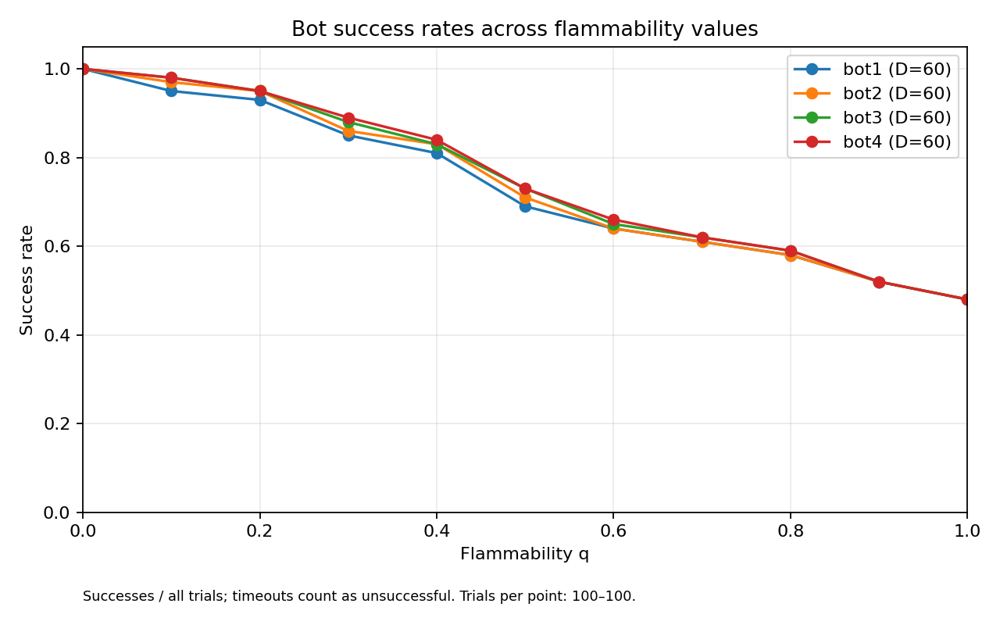
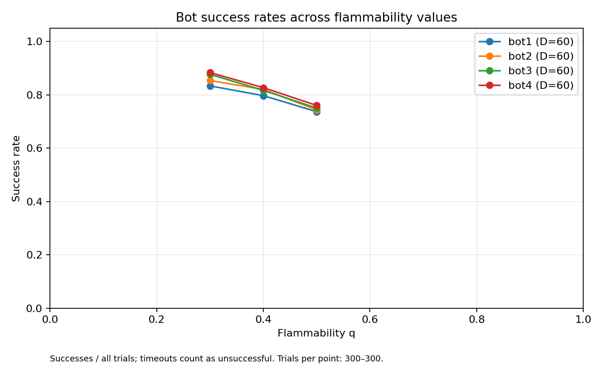

# Project 1: This Ship Is on Fire

> HISTORICAL DRAFT: The experiments below used a burnable button.
> Remote commit 03fabb5 records the TA clarification that the button is
> fireproof. The current code follows that clarification. All results,
> graphs, statistical comparisons, and fire-based diagnoses below require
> regeneration and revision before submission. This is not the final writeup.

Analysis draft based on the implemented bots and the completed exploratory
experiment. The results support preliminary comparisons; further trials are
needed before claiming a reliable performance ranking.

## 1. Bot 4: forecast-based risk planning

Bots 1-3 use shortest paths with different forbidden cells. Bot 1 plans once,
Bot 2 replans around current fire, and Bot 3 also avoids fire-adjacent cells
when possible. Bot 4 instead estimates future fire risk and chooses a route
that minimizes an approximate cumulative risk cost. It is therefore not
simply Bot 3 with a wider fire buffer.

At each decision, Bot 4 observes the grid, current bot position, button,
current fire, and flammability q. It first finds a shortest path avoiding
current fire. If that path takes L moves, its forecast horizon is H = L + 20.
If no such path exists, it stays in place. Because fire only grows, an
already-disconnected route cannot reopen without reaching the button.

Let P_t(c) denote the forecast probability that cell c is burning after t
additional fire updates. Initially, burning cells have probability 1 and
other cells have probability 0. For an open cell, the forecast updates as:

    P_(t+1)(c) = P_t(c) + (1 - P_t(c)) *
                (1 - product over neighbors n of (1 - q * P_t(n)))

Walls cannot ignite. This uses the assignment's neighbor-based ignition
rule, but approximates neighbor burning events as independent. Real fire
states are correlated, so these probabilities are estimates rather than
an exact distribution of future fires. The experiments use the default
`button_immune=False`; the button can burn like any other open cell.

Bot 4 assigns occupying cell c on move t the cost:

    cost_t(c) = -log(1 - P_t(c))

Walls and cells with forecast probability at least 1 - 1e-12 receive infinite
cost. Taking logarithms turns a product of estimated survival probabilities
into an additive path cost. However, survival across turns is also correlated:
the accumulated cost is a planning heuristic, not an exact failure probability.

The button is a special terminal destination. It is pressed before fire
advances that turn, so entering it on move t uses P_(t-1), not P_t.

A dynamic program stores the lowest accumulated cost for each cell at each
future move count. Each layer considers four neighboring predecessor cells.
Bot 4 selects the lowest-cost arrival at the button within H moves and
backtracks to recover the first move. It executes only that move, then
replans from the actual observed fire on the next turn. The planner considers
moving paths, including possible revisits, but has no explicit stay action.
If every forecast route has infinite cost, it follows the first step of the
current shortest fire-avoiding path instead.

The implementation uses NumPy shifts for neighbor calculations and caches
the Boolean grid between turns. Forecasting and layered planning take
O(H * D^2) time per decision and O(H * D^2) memory for stored layers.
The bounded horizon controls cost but can miss worthwhile longer detours.

## 2. Experiments and success rates

The main exploratory experiment used 60x60 generated ships, 100 different
initial scenarios, and q values 0.0, 0.1, ..., 1.0. Each scenario placed the
bot, button, and initial fire on three distinct randomly selected open cells.
All four bots were evaluated at every q, giving 4,400 runs.

Within a scenario, all bots shared the same layout, initial positions, and
fire seed. Fire spreading does not depend on bot movement, so equal elapsed
turns have equal fire states until a run terminates. The same scenarios were
also reused across q values; observations across q are therefore paired,
not independent samples.

The sweep used ten batches of ten scenarios, with experiment seeds 400-409.
The raw CSV stores ship and fire seeds and positions for replay. A run could
last at most 5,000 turns; timeouts would count as unsuccessful and be reported
separately. None occurred. The sweep took 820.6 seconds before final plotting.

| q | Bot 1 | Bot 2 | Bot 3 | Bot 4 |
| --- | ---: | ---: | ---: | ---: |
| 0.0 | 100% | 100% | 100% | 100% |
| 0.1 | 95% | 97% | 98% | 98% |
| 0.2 | 93% | 95% | 95% | 95% |
| 0.3 | 85% | 86% | 88% | 89% |
| 0.4 | 81% | 83% | 83% | 84% |
| 0.5 | 69% | 71% | 73% | 73% |
| 0.6 | 64% | 64% | 65% | 66% |
| 0.7 | 61% | 61% | 62% | 62% |
| 0.8 | 58% | 58% | 59% | 59% |
| 0.9 | 52% | 52% | 52% | 52% |
| 1.0 | 48% | 48% | 48% | 48% |

The bots have similar performance, but are not identical. In this sample,
Bot 4 matches or exceeds the others at every tested q. Its largest advantage
over Bot 1 is four percentage points, at q=0.3 and q=0.5. That is only four
additional successful scenarios out of 100. These differences do not by
themselves establish a statistically reliable ranking. Further evaluation
should use more paired trials, finer q spacing around 0.3-0.5, and uncertainty
estimates for paired differences.

A follow-up added 200 new ships at q=0.3, 0.4, and 0.5, giving 300 paired
scenarios per point. At q=0.3, Bots 1-4 succeeded on 250, 256, 263, and 265
ships; at q=0.4 on 239, 246, 245, and 248; at q=0.5 on 221, 223, 225,
and 228. There were no timeouts. The new runs took 487.7 seconds before
plotting. Full methods and uncertainty estimates are in
`results/focused_analysis.md`.

The Bot 4 minus Bot 1 difference at q=0.3 is 5 percentage points, with a
paired percentile bootstrap 95% interval of approximately [2.67, 7.67].
Exact paired tests with Holm correction over nine comparisons support
Bot 4 over Bot 1 at q=0.3 and q=0.4, and over Bot 2 at q=0.3. They do not
establish an advantage over Bot 3. These are exploratory findings: the
q values were chosen from the first sweep and that data is included in
the pooled analysis. Small discordant counts also limit inference.

At low q, many shortest routes finish before the fire becomes dangerous.
At high q, fast fire spread leaves less opportunity for strategy to help.
The observed convergence at q=0.9 and q=1 matches the assignment's predicted
trend. It does not mean the bots always choose the same paths.

Runtime benchmarks used three ships at each of five q values for each grid
size. On 60x60 grids, mean complete-trial times for Bots 1-4 were approximately
0.099, 0.111, 0.113, and 0.218 seconds; on 80x80, they were 0.300, 0.415,
0.433, and 0.880 seconds. These include fire simulation and all bot decisions,
not just planning. D=60 was selected for exploration to keep repeated runs
practical. D=80 ran successfully in the benchmark but has not yet received
a full success-rate sweep; the benchmarks do not establish a hardware limit.

## 3. Why bots fail: replay evidence

Every selected replay reproduced its saved outcome and turn count, and all
recorded moves were checked for adjacency or staying and open destinations.
Coordinates below use zero-based row and column indices.

### Trial 9, q=0.5

Bot 1 failed on turn 8. Bot 2 succeeded on turn 36, while Bots 3 and 4
succeeded on turn 34. At turn 8, Bots 1 and 2 were at (40,30), observing
the same fire. Bot 1 continued to (39,30), which ignited during that turn's
spread. Bot 2 moved back to (41,30) and eventually escaped.

Bot 3 diverged from Bot 2 one turn earlier, choosing (41,31) instead of
(40,30). Bot 4 first diverged from Bot 3 on turn 4. The surviving paths
demonstrate that different decisions could save a bot on this realized fire
sequence. They do not imply the next random ignition was knowable in advance.

### Trial 4, q=0.3

Bot 1 failed on turn 44, Bots 2 and 3 on turn 59, and Bot 4 succeeded on
turn 55. Bot 1 entered existing fire at (22,48) while following its initial
plan. Immediately before that move, a 20-move path avoiding current fire
existed from its position. Entering fire was avoidable, although the existence
of that path alone does not guarantee future survival.

Bots 2 and 3 followed the same path. By turn 59, the button was burning and
no safe route to it existed. They stayed at (24,56), which then ignited.
An open, non-burning neighbor remained, but moving there could not restore
access to an already-burning button. Success was impossible from that state.

Bot 4 diverged from Bot 3 on turn 3, choosing (42,27) instead of (41,26),
and reached the button before it burned. This supports considering future
risk early rather than waiting until current fire blocks the shortest path.
It does not prove that every individual decision on Bot 4's route was optimal.

### Bot 4 failures: unavoidable loss versus hindsight escape

To diagnose Bot 4 failures, a separate search was given the actual future
fire sequence. It tracks all reachable cells at every turn, permits staying,
and respects success before fire advances. This is an oracle for diagnosis,
not a legal forecasting strategy. A surviving oracle route proves that an
escape existed on that realized sequence; it does not prove a bot without
future knowledge should have chosen that route.

In trial 6 at q=0.1, the initial shortest fire-avoiding route needs 54 moves,
but the button ignites after fire update 25. Bot 4 eventually burns on turn
133. No decision can reach the button in time on this sequence. Trial 22 at
q=0.1 is similar: the shortest route needs 47 moves, but the button ignites
on the first update. Bot 4 burns on turn 374. These long survival times
should not be mistaken for opportunities to complete the task.

Trial 58 at q=0.3 is less obvious. The initial shortest route needs 61
moves, and the button ignites on update 71, yet the oracle finds no surviving
route before that ignition. Distance to the button alone does not establish
feasibility: intervening cells can burn first. Bot 4 burns on turn 93.

In trial 47 at q=0.4, all four bots fail, but the oracle finds a surviving
91-move route. Bot 4 burns on turn 29 at (31,23). By that turn, current fire
disconnects it from the still-unburned button. Its path first diverges from
the recovered oracle route on turn 17: Bot 4 chooses (25,18), while that
oracle route uses (24,17). The oracle route was independently replayed
against the same seeded fire and checked for legal moves and survival.

This last case demonstrates a missed escape on the realized sequence. It
does not isolate one cause: forecast independence assumptions, approximate
survival costs, the limited horizon, and the realized random spread are
possible contributors. We have not tested alternative horizons or policies
to attribute the failure to one of them. A successful foresighted route
also does not establish that it had higher expected survival before seeing
the random fire outcomes.

## 4. An ideal bot and computation time

An ideal decision policy would use the full current state: ship layout,
bot position, button location, burning cells, and q. It would evaluate each
legal move, including staying, over possible future fire outcomes and future
decisions. In principle, a stochastic decision model could maximize the
probability of reaching the button alive. This differs from choosing one
fixed forecast route: future decisions can adapt to future observations.

Exact planning is expensive because every open cell can contribute to a
possible fire configuration. A practical alternative is to simulate several
future fire trajectories for each candidate first move, evaluate escape
policies on them, and choose the move with the best estimated success rate.
This approach would still need enough samples and an explicit computation
budget; it is a proposal, not an implemented or tested improvement.

The current simulator advances fire only after a bot returns its move, so
longer computation does not cause additional spread. Our runtime measurements
therefore cannot demonstrate the real-time tradeoff described in the prompt.
In a real-time setting, planning would need a deadline. A bot could compute
a quick fallback move first and improve it while time remains. Near imminent
fire, a fast escape decision may be better than a more sophisticated result
that arrives too late. With more separation from fire, additional planning
may be worthwhile. Deadline-aware behavior would require separate evaluation.

## Remaining work before a final submission

- If a stronger performance claim is needed, evaluate the selected
  comparisons on a separate confirmation sample or additional grid sizes.
- If improving Bot 4, compare alternative decisions or horizons on its
  diagnosed failure cases across fresh fire seeds, rather than optimizing
  only for one known fire sequence.
- Decide whether to run the larger D=80 sweep based on the available time.
- Review this draft, submission format, dependencies, and reproduction
  instructions. The optional safe-layout bonus has not been implemented.

Evidence: `results/exploratory_60.csv`, `results/exploratory_60.png`,
`results/replay_9_q05.json`, `results/replay_4_q03.json`, `benchmark.py`,
and `tests/test_pathfinding.py`.
