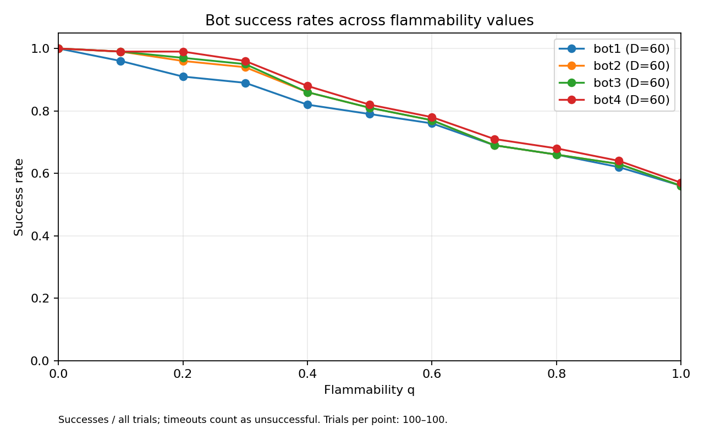

# Project 1: This Ship Is on Fire

Writeup draft using the corrected fireproof-button rules. All performance
results and diagnoses in this document come from the current implementation.
The earlier burnable-button experiments are excluded.

## 1. Problem, strategies, and design objective

The task is to reach the fire-suppression button on a randomly generated
ship before the bot burns. The ship is a square grid with orthogonal movement;
the bot may move to an adjacent open cell or stay. Fire grows simultaneously
using ignition probability \(1-(1-q)^K\), where \(K\) counts burning neighbors.
The button cannot ignite, following the TA clarification recorded in the
repository. Its neighbors can burn and make it unreachable.

Every turn, the bot decides and moves. Entering existing fire fails; entering
the button succeeds immediately. Otherwise fire spreads, and the bot fails
if its cell ignites. Thus the last move to the button does not require surviving
another fire update.

Bot 1 follows one initial shortest path avoiding the initial fire. Bot 2
recomputes a shortest path avoiding current fire every turn. Bot 3 first tries
to avoid current fire and its adjacent cells, excluding the fireproof button
from that buffer; if no route exists, it falls back to Bot 2's rule.

Bot 4 was designed to address a weakness shared by shortest-path strategies:
a cell that is safe now can be dangerous by the time the bot reaches it.
Its objective is to select a path with low predicted fire risk at the time
each cell would be occupied. Unlike a larger geometric fire buffer, this
uses flammability, distance through the ship, and expected arrival time.

## 2. Bot 4: precise algorithm and rationale

### Forecasting future fire

Let \(P_t(c)\) estimate the probability that cell \(c\) is burning after
\(t\) additional fire updates. Currently burning cells start at probability
one; other cells start at zero. For an ignitable cell, the update is

\[
P_{t+1}(c)=P_t(c)+(1-P_t(c))
\left[1-\prod_{n\in N(c)}(1-qP_t(n))\right].
\]

Walls and the button cannot ignite. The product estimates the probability
that no neighbor ignites the cell, treating neighbor burning events as
independent. This approximation provides a cheap deterministic forecast
instead of enumerating all future fire configurations or sampling many
simulations for every decision. It also propagates risk through hallways
rather than treating all cells at the same geometric distance as equivalent.

The approximation is not exact: nearby fire events are correlated, and
neighbor probabilities conditional on this cell remaining safe differ from
their unconditional probabilities. We use the forecast to rank routes, not
as a calibrated guarantee of survival.

### Converting risk into a path cost

For cell \(c\) occupied after move \(t\), the cost is

\[
w_t(c)=-\log(1-P_t(c)).
\]

The reason for this transformation is that maximizing a product of estimated
survival probabilities is equivalent to minimizing a sum of negative
logarithms. A cell with low risk has a small cost; risk near one receives a
large penalty. Walls and probabilities at least \(1-10^{-12}\) receive
infinite cost. The button has zero cost because it is fireproof and reaching
it terminates the trial before the next fire update.

This objective balances route length and exposure without a separate
arbitrary distance weight: a longer route can still be preferred if its
accumulated risk is lower. At q=0, non-burning open cells have zero cost.
The implementation selects the earliest minimum-cost arrival in a tie.
Across turns, survival events are correlated too, so multiplying these
marginal probabilities remains an approximation.

### Searching through time

First, Bot 4 computes a current shortest path avoiding fire. Let its length
in moves be \(L\). The planning horizon is \(H=L+20\). The additional 20
moves allow detours while bounding computation. Twenty is an engineering
heuristic, not an experimentally optimized constant or a proof that all
worthwhile routes fit within the horizon.

Let \(C_t(c)\) be the lowest accumulated risk cost for reaching \(c\) after
\(t\) moves. Initialize the bot's cell with zero cost and all other cells
with infinity. Each later layer computes

\[
C_t(c)=w_t(c)+\min_{n\in N(c)}C_{t-1}(n).
\]

Bot 4 chooses the lowest-cost button arrival over moves 1 through H and
backtracks to recover its first move. Only that move is executed; the next
turn starts a new forecast from the actual fire. Replanning avoids committing
to predictions that may become inaccurate. The time-layer search allows
revisiting cells but does not explicitly consider staying.

If current fire disconnects the bot from the button, Bot 4 stays. Because
fire never recedes, no later route can reopen from that state. If a current
safe path exists but every forecast route has infinite cost, it takes the
first move of that shortest path. This fallback makes an attempt when the
approximate forecast is too pessimistic, rather than treating the model's
prediction as certain failure.

### Efficiency

NumPy shifts evaluate the four-neighbor forecast and predecessor minima
over the grid. The Boolean grid is cached between turns. Forecasting and
planning use \(O(HD^2)\) time per decision and \(O(HD^2)\) memory for the
stored layers. The horizon is consequently both a behavioral choice and
a computation budget.

Earlier runtime benchmarks showed that 80x80 ships are feasible, but Bot 4
was substantially slower than the simpler strategies. Those benchmarks
preceded the fireproof-button correction and are not treated as current-rule
timing estimates here. We used 60x60 ships for the new repeated experiments;
the measured current-rule collection times are reported below.

## 3. Experiments and results

### Method

The full-range sweep used 100 generated 60x60 ships at each q in
0.0, 0.1, ..., 1.0. Each scenario randomly placed the bot, button, and
initial fire on three distinct open cells. All four bots ran on every
scenario, giving 4,400 runs.

For fair comparisons, bots shared the same ship, initial positions, and
fire seed, but had separate persistent state and random-generator objects.
Bot movement does not change fire spread, so equal elapsed turns observe
the same fire progression. The same 100 scenarios were reused across q;
results at different q values are therefore dependent.

A focused follow-up added 200 new scenarios at q=0.3. Combined with the
100 sweep scenarios at that q, this gives 300 paired observations. There
are 5,200 distinct runs overall: the 400 original q=0.3 rows also appear
in the focused file and are not counted twice.

The sweep used experiment seeds 600-609 in batches of ten ships. The
follow-up used seeds 700-709 in batches of twenty. All raw rows store
ship seeds, fire seeds, positions, a rule label, and the 5,000-turn cutoff.
No run timed out. The sweep took 827.3 seconds; the full collection,
including the focused trials and intermediate plotting, took 999.9 seconds.

### Full-range graph

| q | Bot 1 | Bot 2 | Bot 3 | Bot 4 |
| --- | ---: | ---: | ---: | ---: |
| 0.0 | 100% | 100% | 100% | 100% |
| 0.1 | 96% | 99% | 99% | 99% |
| 0.2 | 91% | 96% | 97% | 99% |
| 0.3 | 89% | 94% | 95% | 96% |
| 0.4 | 82% | 86% | 86% | 88% |
| 0.5 | 79% | 81% | 81% | 82% |
| 0.6 | 76% | 77% | 77% | 78% |
| 0.7 | 69% | 69% | 69% | 71% |
| 0.8 | 66% | 66% | 66% | 68% |
| 0.9 | 62% | 63% | 63% | 64% |
| 1.0 | 56% | 56% | 56% | 57% |

At q=0, all bots succeed. At low flammability, most routes finish before
fire becomes limiting. At q=0.2-0.4, the graph shows Bot 4 above all three
other bots in observed success rate. At high q, the curves approach each
other, as expected when rapid spread leaves little time for strategic
detours. They are not exactly identical in this finite sample. In particular,
q=1 gives 56 successes for Bots 1-3 and 57 for Bot 4; this one-scenario
difference is not a basis for a broad high-q superiority claim.

### Focused comparison and uncertainty

| Bot | Successes at q=0.3 | Success rate |
| --- | ---: | ---: |
| Bot 1 | 264/300 | 88.00% |
| Bot 2 | 275/300 | 91.67% |
| Bot 3 | 278/300 | 92.67% |
| Bot 4 | 282/300 | 94.00% |

For each comparison, a win means Bot 4 succeeds while the other bot fails;
a loss means the reverse. Ties are included in the 300-trial denominator.

| Bot 4 versus | Wins / losses | Difference, percentage points | Holm-adjusted exact p |
| --- | ---: | ---: | ---: |
| Bot 1 | 19 / 1 | +6.00 | 0.000120 |
| Bot 2 | 8 / 1 | +2.33 | 0.078125 |
| Bot 3 | 4 / 0 | +1.33 | 0.125000 |

The test is exact two-sided McNemar: condition on the number of discordant
pairs and compare their split with a binomial distribution of probability
one half. Holm correction accounts for the three planned q=0.3 comparisons.
At a conventional familywise threshold of 0.05, only Bot 4 versus Bot 1
is supported. Bot 4's higher observed success rate does not establish that
it reliably beats Bots 2 and 3.

A paired percentile bootstrap with 20,000 resamples and generator seed 42
gives approximate 95% intervals of [3.33, 9.00], [0.67, 4.33], and
[0.33, 2.67] percentage points for these differences. These intervals are
pointwise and can be optimistic with few discordant pairs. For Bot 3, the
bootstrap cannot generate a Bot 4 loss that was never observed; the
interval's exclusion of zero is not stronger evidence than the exact test.
Four additional successes among 300 ships is a modest estimated advantage.

The q=0.3 follow-up was chosen from earlier exploration under the old rules
and fixed before the corrected experiment finished. Bot parameters were
not tuned to these results. More data may clarify the small differences,
but continuing until a favorable test result appears would undermine the
comparison. The present report distinguishes observed improvement from a
general claim of dominance.

## 4. Failure diagnoses and different decisions

All cases below use q=0.3 and current fireproof-button rules. Coordinates
are zero-based (row, column). Replays reproduced the saved outcomes and
checked legal moves. A hindsight oracle separately searches all reachable
time-layer states, including staying, using the realized future fire.
It diagnoses whether an escape existed on that sequence; it is not a
strategy available to a bot that cannot know future random ignitions.

| Focused trial | Bot 1 | Bot 2 | Bot 3 | Bot 4 |
| --- | --- | --- | --- | --- |
| 50 | Burns, 38 | Burns, 61 | Burns, 60 | Success, 79 |
| 249 | Success, 68 | Success, 68 | Burns, 100 | Burns, 81 |
| 0 | Burns, 49 | Burns, 82 | Burns, 82 | Burns, 82 |

### Trial 50: a risk-aware detour succeeds

Bots 3 and 4 first make different moves on turn 18, from (43,19):
Bot 3 enters (43,20), while Bot 4 moves to (42,19). Their fire observations
are identical. Bot 4 eventually succeeds in 79 turns. The hindsight oracle
also finds a 79-move escape, independently verified against the same fire.

Bot 1 enters existing fire at (50,31) on turn 38. Immediately before that
move, a 34-move path avoiding current fire still exists, so entering fire
was avoidable, though future survival along an alternative was not assured.

Bots 2 and 3 become disconnected from the button by turn 51. They then
stay and are eventually caught by spread. The button itself remains
unburned; the loss is caused by burning routes around it.

### Trial 249: excessive detouring loses a winnable scenario

Bots 1 and 2 succeed in 68 turns, so this failure does not require an oracle
to demonstrate an available successful strategy. Bot 4 first diverges
from Bot 1 on turn 23 at (20,15), choosing (20,14) rather than (21,15).
Bot 3 follows the direct route longer, then diverges on turn 55.

Bot 4 burns on turn 81 after entering (44,34), which ignites during that
turn's spread. Before that move, a two-move route to the button exists.
The cell was not already burning; the failure is not an illegal move into
known fire. Bot 3 later becomes disconnected and burns on turn 100.
The hindsight oracle recovers a verified 68-move escape.

This case illustrates the cost of spending too long seeking lower modeled
risk. To test one design choice directly, we repeated Trials 50 and 249
with only the horizon slack changed:

| Extra horizon moves | Trial 50 | Trial 249 |
| --- | --- | --- |
| 0 | Burns, 61 | Success, 68 |
| 5 | Burns, 61 | Success, 68 |
| 20 (default) | Success, 79 | Burns, 81 |
| 40 | Success, 79 | Burns, 81 |

These eight diagnostic runs are separate from the reported performance
sample. Longer planning allowance helps one case and harms the other.
This is specific evidence that the slack changes behavior, not proof that
a shorter horizon is globally better. The default remains 20: we did not
tune it to two selected seeds. Future tuning would need separate training
and evaluation scenarios and fresh fire draws.

### Trial 0: no escape on the realized sequence

The hindsight search finds no escape and exhausts all surviving reachable
states on turn 266, well before its 5,000-turn cutoff. Thus even advance
knowledge of this fire progression cannot produce a successful path from
the initial state. Bots 2-4 lose access to the button by turn 39 and later
burn; Bot 1 continues its fixed plan into existing fire.

This diagnosis concerns one realized stochastic sequence. It does not
mean the same starting configuration is unwinnable under every fire draw.

## 5. Research process, expectations, and surprises

The intended benefit of Bot 4 was most pronounced where fire spreads fast
enough to matter but slowly enough that alternate routes remain useful.
The broad graph is consistent with that expectation: low-q outcomes are
close to uniformly successful, and the curves are close at high q.

An early tiny demo made all four bots burn on the same first turn. A small
10x10 sample also produced overlapping success-rate curves. Those observations
initially raised concern that the algorithms were effectively identical.
Controlled layouts and full-path replays showed otherwise: Bot 3 can take
a buffer-driven detour, and Bot 4 can choose a different move from Bots 2-3
under identical fire observations. Aggregated success rates can conceal
different decisions, including choices that happen to lead to the same outcome.

A rule clarification was another important change in the process. The first
experiments let the button burn. After the TA clarification was incorporated,
we separated those artifacts and collected the evidence used here again.
Their old rates and claims about button ignition are not combined with
current results.

The modest advantage over Bot 3 was a useful surprise. A more computationally
expensive strategy is not automatically much more effective. Trial 249 and
the horizon experiment show a concrete downside: a predicted low-risk detour
can lose a scenario that a shorter direct route wins. Trial 50 shows the
opposite benefit. Together, these suggest that route risk and urgency need
to be balanced, rather than assuming that more lookahead always helps.

## 6. Ideal bot and the computation-time tradeoff

An ideal policy would use the complete observed state: grid layout, position,
button location, burning cells, and q. It would consider each legal action,
including staying, and integrate over possible future fire outcomes and
subsequent decisions. Maximizing the probability of reaching the button
is different from optimizing one forecast route: future actions adapt to
future observations.

Exact stochastic planning has a large state space because many subsets of
open cells can be burning. A practical alternative is limited simulation
of future fire trajectories for candidate moves, with a fast escape policy
evaluated on each trajectory. This could represent correlations missed
by the current forecast, but would have sampling error and runtime cost.
It is a proposed direction, not an implemented improvement.

The current simulator waits for a bot to return its decision before
advancing fire. Longer computation therefore cannot directly cause
additional spread in these experiments. Our timing does not establish
a real-time benefit or penalty. In a real-time system, the bot would need
a decision deadline: compute a cheap fallback first, then improve it while
time remains. Near imminent fire, making a fast move may matter more than
refining a plan that arrives too late. With more separation, extra
computation may be useful.

The instructor's guaranteed-win hint also suggests a possible data-collection
optimization. Fire cannot propagate through more than one edge per update.
If a proposed route reaches every intermediate cell strictly before its
earliest possible ignition, and then reaches the button, that route is
safe even under maximally fast spread. This can certify a particular route
without running stochastic trials. It does not automatically certify any
bot that might choose a different route; we have not used this shortcut
in the reported experiments.

## 7. Limitations and reproducibility

The evidence uses one grid size and a finite set of seeds. The coarse q
spacing can miss narrow regions of different behavior. We do not claim
statistical superiority over Bot 3, globally optimal survival probabilities,
or calibrated forecast probabilities. The default slack was not optimized.
The optional safe-layout bonus was not attempted.

Run the tests with python3 -m unittest discover -s tests -v. Reproduce the
collection with python3 -u collect_evidence.py, then run
python3 summarize_evidence.py to verify paired scenarios and recompute
the tables and statistics. Detailed methods and raw data are in
results/fireproof/. Replays for Trials 50, 249, and 0, including hindsight
paths where they exist, are saved there. The horizon sensitivity outcomes
are in horizon_diagnostics.csv in the same directory.

The next preparation step is to typeset this revised draft in LaTeX and
inspect the compiled PDF. No claim depends on the grader reading code
to reconstruct Bot 4's decisions or the experiment's main findings.
